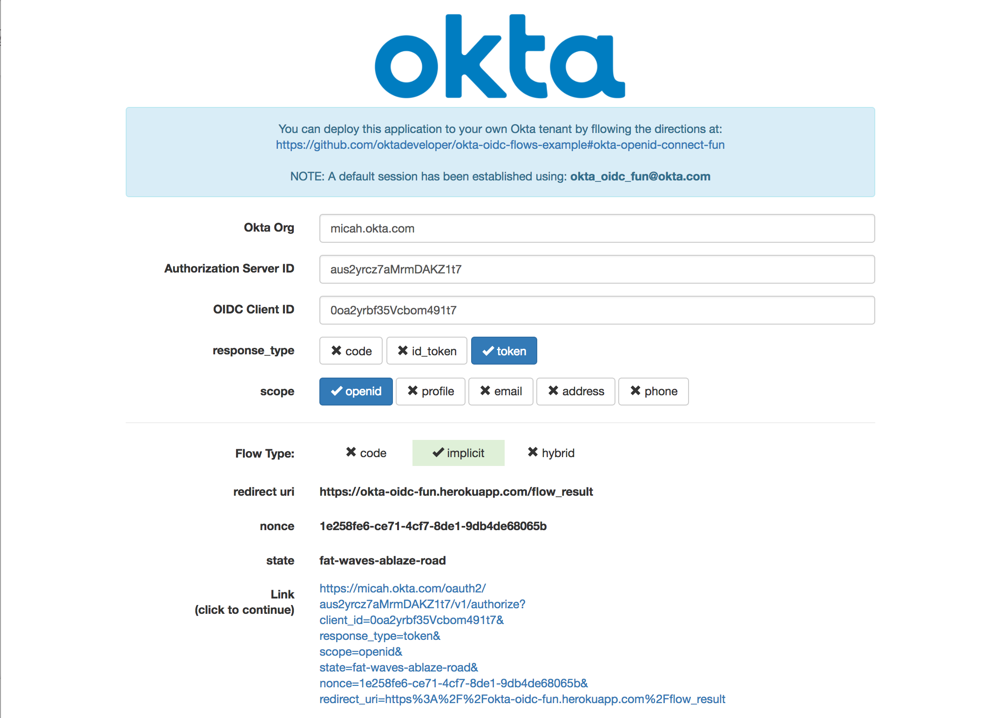

## Play Zork and Learn OpenID Connect

This is an example app that let's you play the Infocom classic: [Zork](https://en.wikipedia.org/wiki/Zork).

But, there's a catch: All interactions with the game must be done using an [Access Token](https://developer.okta.com/blog/2017/07/25/oidc-primer-part-1#all-about-tokens).

## Jump In

### First, try hitting the Zork endpoint without an access token.

1. From the command line, execute the following (uses [HTTPie](https://httpie.org)):

    ```
    http POST https://okta-oauth-zork.herokuapp.com/v1/c
    ```
    
2. You'll see a response like this:

    ```
    HTTP/1.1 302
    Cache-Control: no-cache, no-store, max-age=0, must-revalidate
    Connection: keep-alive
    Content-Length: 0
    Date: Mon, 11 Sep 2017 21:41:19 GMT
    Expires: 0
    Location: https://okta-oauth-zork.herokuapp.com/login
    ```
    
It's trying to redirect you to: `https://okta-oauth-zork.herokuapp.com/login` 
because you're not authenticated. 

### Next, try hitting the Zork endpoint with an access token.

1. Browse to the [OIDC Playground](https://okta-oidc-fun.herokuapp.com)    
2. Click off `code` and click on `token` for `response_type`

    

3. Click the `Link` at the bottom of the page

    
    
4. Copy the `Access Token`
5. From the command line, execute the following (uses [HTTPie](https://httpie.org)):

    ```
    http POST \
    https://okta-oauth-zork.herokuapp.com/v1/c \
    Authorization:"Bearer <access token>"
    ```  

6. You'll see a response like this:

    ```
    {
        "gameInfo": [
            "ZORK I: The Great Underground Empire",
            "Copyright (c) 1981, 1982, 1983 Infocom, Inc. All rights reserved.",
            "ZORK is a registered trademark of Infocom, Inc.",
            "Revision 88 / Serial number 840726"
        ],
        "look": [
            "",
            "West of House",
            "You are standing in an open field west of a white house, with a boarded front door.",
            "There is a small mailbox here."
        ],
        "status": "SUCCESS"
    }
    ```
    
7. You can give it commands too. For instance, to `go north`:

    ```
    http POST \
    https://okta-oauth-zork.herokuapp.com/v1/c \
    Authorization:"Bearer <access token>"
    command="go north"
    ```
    
    ```
    {
        "gameInfo": [
            "ZORK I: The Great Underground Empire",
            "Copyright (c) 1981, 1982, 1983 Infocom, Inc. All rights reserved.",
            "ZORK is a registered trademark of Infocom, Inc.",
            "Revision 88 / Serial number 840726"
        ],
        "look": [
            "",
            "West of House",
            "You are standing in an open field west of a white house, with a boarded front door.",
            "There is a small mailbox here."
        ],
        "request": "go north",
        "response": [
            "North of House",
            "You are facing the north side of a white house. There is no door here, and all the windows are boarded up. To the north a narrow path winds through the trees."
        ],
        "status": "SUCCESS"
    }
    ```    
    
## Cross Origin Resource Sharing (CORS)

You can set a list external base urls (origins) that are allowed to access the `/v1/c` endpoint. This is useful in 
demonstrating a site that makes an ajax call and passes in a valid access token. 
The [OIDC Playground](https://okta-oidc-fun.herokuapp.com) does just that. Its source can be found
[here](https://github.com/oktadeveloper/okta-oidc-flows-example). 

## Learn More

Curious about what's going on here? Dive into our `OIDC Primer` series:

* [Identity, Claims, & Tokens – An OpenID Connect Primer, Part 1](https://developer.okta.com/blog/2017/07/25/oidc-primer-part-1)
* [OIDC in Action – An OpenID Connect Primer, Part 2](https://developer.okta.com/blog/2017/07/25/oidc-primer-part-2)
* [What’s in a Token? – An OpenID Connect Primer, Part 3](https://developer.okta.com/blog/2017/08/01/oidc-primer-part-3)
